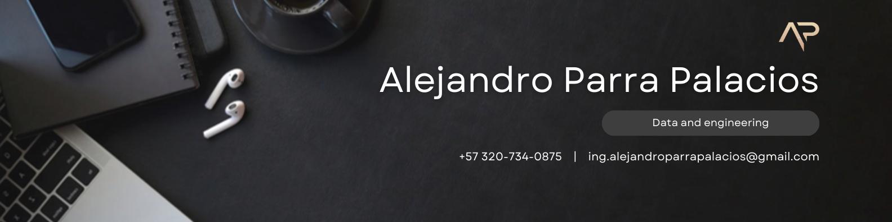

# ¡Hola! 👋 Soy Alejandro Parra Palacios

Data Engineer with experience designing and implementing scalable cloud data architectures using Azure, Databricks,
and Microsoft Fabric. Strong background in ETL/ELT development, medallion architecture (Bronze–Silver–Gold),
dimensional modeling, and Big Data processing with Python and PySpark. Experienced integrating enterprise data
from Oracle Fusion ERP, optimizing large-scale data pipelines, automating data quality processes, and enabling analytics
and machine learning workflows across distributed systems.

## 🔧 Tecnologías y Herramientas

- **Lenguajes de Programación:** Python, Scala, SQL, PySpark, R, JavaScript, Java
- **Cloud & Big Data:** Azure, Databricks, Microsoft Fabric, Snowflake
- **Orquestación:** Apache Airflow, Azure Data Factory
- **Data Engineering:** ETL/ELT, Medallion Architecture, Star Schema
- **Visualización de Datos:** Power BI, Oracle OTBI
- **Bases de Datos:** Oracle Fusion, SQL Server, PostgreSQL, MySQL, MongoDB
- **DevOps & Otros:** Docker, Git, CI/CD, Linux

  

## 🌱 Actualmente Aprendiendo
- Aplicaciones avanzadas de Machine Learning e Inteligencia Artificial
- Nuevas herramientas y técnicas de desarrollo de software

## 💪 Habilidades Clave
- **Mejora de Procesos**
- **Inglés Profesional (B2)**
- **Resolución de Problemas**
- **Mentalidad de Crecimiento**

## 📫 Cómo Contactarme

## 📈 Mis Estadísticas de GitHub

¡Gracias por visitar mi perfil! Siéntete libre de explorar mis repositorios y proyectos. Siempre estoy abierto a colaborar en nuevas y emocionantes oportunidades.
